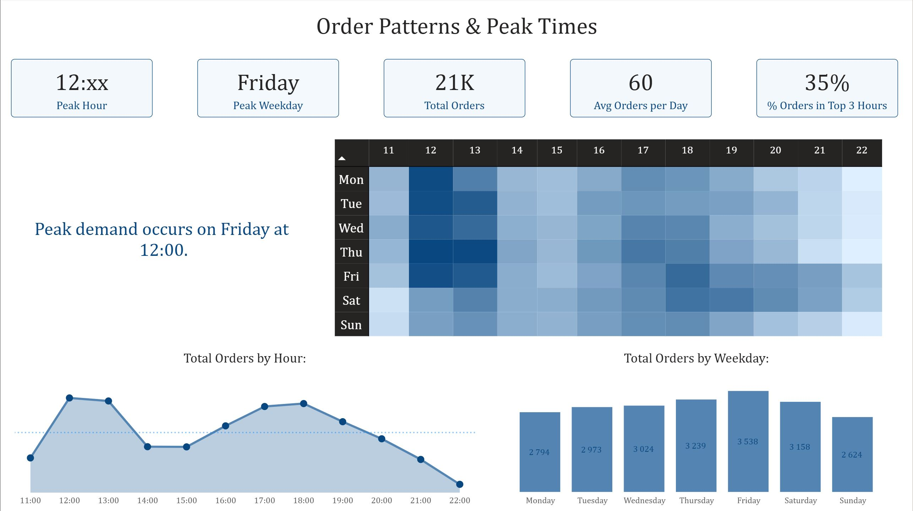

# Pizza Sales Analysis – Power BI

This project presents a full-year sales analysis for a pizza business using Power BI.

The report focuses on:
- Time-based performance (hourly, daily and monthly trends)
- Product and category breakdown
- Executive-level KPIs and cumulative performance

The goal was to practice DAX fundamentals including CALCULATE, FILTER, RANKX, running totals, and dynamic insights.

## Project Files

- Power BI report: `pizza_sales_report.pbix`
  
## Data Model

- Fact tables: order_details, orders
- Dimension tables: pizzas, pizza_types, calendar
- Star schema design (with normalized product dimensions)
- Dedicated Calendar table (no auto date/time)

## Key DAX Techniques

- Running total using CALCULATE and FILTER
- Dynamic ranking with RANKX
- Context manipulation using ALL and REMOVEFILTERS
- KPI calculations (AOV, items per order)
- Dynamic insight text measures

## Report Structure

1. Time Analysis  
   - Revenue by hour and weekday  
   - Heatmap visualization  
   - Peak hour identification  

2. Category Breakdown  
   - Revenue and quantity by category  
   - Dynamic Top 10 products  
   - Share of total metrics  

3. Executive Summary  
   - Annual KPIs  
   - Monthly revenue trend  
   - Cumulative revenue  
   - Executive insight statement
  
  ## Screenshots

### Time Analysis

### Category Breakdown

### Executive Summary

